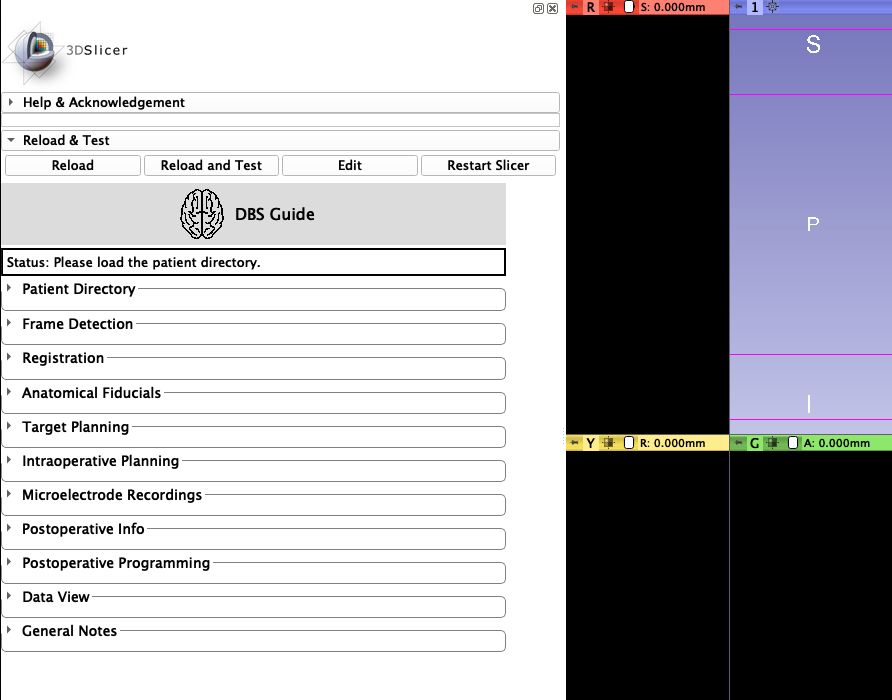

# DBS Guide 
**neurosurgical planning software**
-----------------------------------------------
A documentation of DBS Guide. 
----------------------------------------------- 

**Greydon Gilmore & Wafiq Syed (London Health Sciences Centre, Canada)**

**DBS Guide** is a surgical planning and postoperative assessment tool that can be incorporated into 3D Slicer as an extension module. DBS Guide works to visualize the postoperative localization of the microelectrodes in the patient's brain, by displaying the microelectrodes on the patient's MRI and/or CT scans. Analyzing the visualization that DBS Guide provides, it can be determined if the microelectrodes have been implanted successfully at the planned target area, the subthalamaic nucleus (STN).

