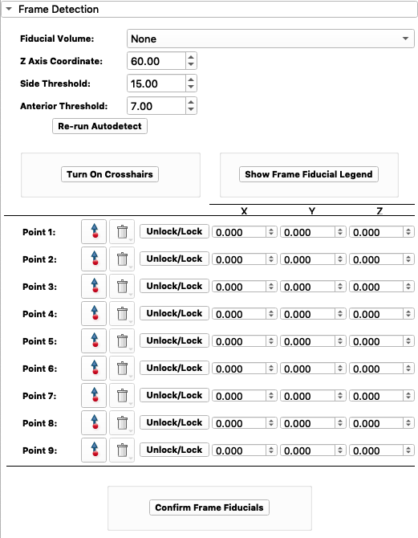

.. _widget02:

Frame Detection
==================

1. Select CT Frame
	Now it's time to set up the frame fiducial points of our CT frame. Click on the drop down menu
	next to ``Fiducial Volume`` and select ``CT Frame``. Then click  ``Confirm Frame Fiducials``.

	.. image:: ../Images/frameDet1.png
	

	.. image:: ../Images/frameDetection1.gif

	.. image:: ../Images/FrameDetectionScan.png

	.. note::
		
		To navigate the Slicer scan screen:
		   	**Move across scan**:
			   	Hold ``Shift`` while holding the the mouse click button and and moving the 
			   	mouse.

		   	**Zoom in/out**:
			   	Hold ``right-click`` while moving mouse up/down. Or you can hold ``Control/Command``
			   	and scroll. 
	   	