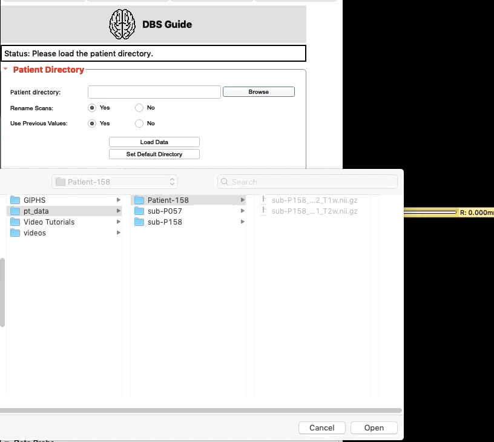
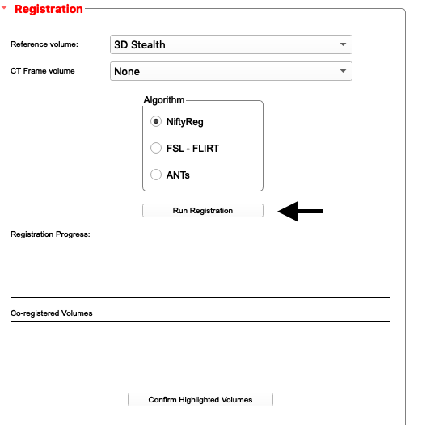
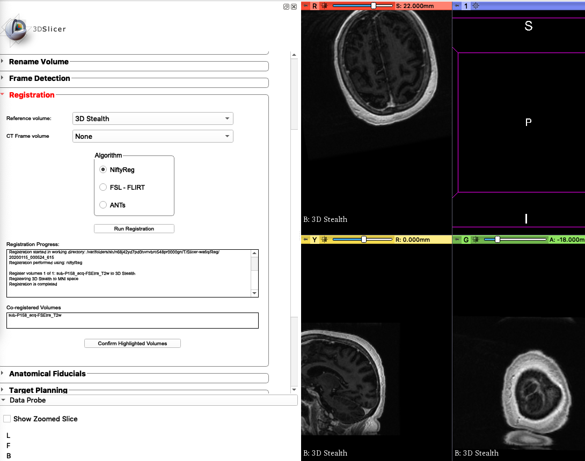
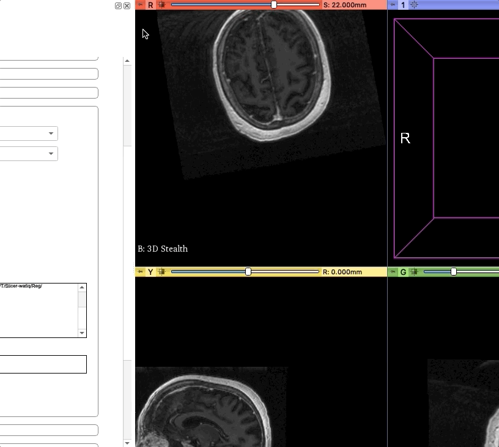
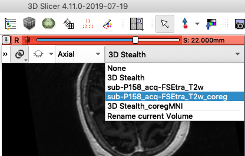

.. _Preop:

Pre-op
=======

.. note::
	To install DBS Guide. Visit our :ref:`installation tutorial <Installation>`

Two to three weeks prior to the surgery, the patient gets an MRI Scan along with several sequences. Among the sequences is a **3D Volumetric Stealth MRI**. Using the ``Registration Widget``, we can **co-register** the MRI scans with the 3D Volumetric Stealth MRI.

1. **Load the patient's directory.** 
	Click ``Browse`` to find your folder with the scans. Notice, we only select the folder and not the files inside the folder. This folder contains folders in the .nii.gz format which means each folder is a gzipped folder of NIFTI (Neuroinformatics Technology Initiative) files. NIFTI files are files of MRI scans.

.. note::

	There are two folders now in your patient directory:
		scene 
			(contains data/scans that will be edited)
		source 
			(contains original brain scans. This folder won't be modified
			so that you don't lose the original scans)

2. **Rename volumes [optional].** 
	If you would like to rename volumes you may do so. 

.. image:: ../Images/Preop/renameVolume.gif
	:align: center

.. note::
	``Frame Detection`` is going to be skipped because the CT frame scan is performed on the day of the surgery. ``Frame Detection`` will be explored in the next phase, ``intra-op``.

3. **Co-register the 3D Volumetric Stealth MRI with the other MRI scans.**
	Using ``Registration``, select the appropraite reference volume, which in our case is ``3D Stealt``. Leave ``CT Frame Volume`` as ``None`` because the frame CT has not been obtained yet. Choose the algorithm of your preference. Then ``Run Registration.`` Note, this may take a while (upto 10 minutes). If your computer freezes, just wait, the program is still running. 

Upon completion:

4. **Confirm that the registration was a success.**
	First link all the scans. 

In the list of scans available, select the scan that ends in ``T2W_coreg``. Note, any scan that ends with ``coreg`` has been coregistered. DBS Guide maintains your previous scans too, so no original data is lost.

