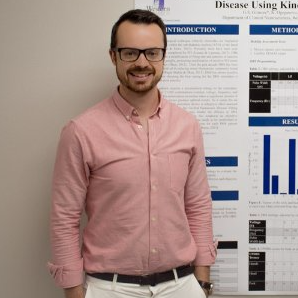

Meet the Researchers
=====================

Greydon Gilmore 
----------------

   
   Ph.D. Candidate in Biomedical Engineering 
   Western University

Greydon Gilmore is a current Ph.D. Candidate in Biomedical Engineering in the lab of Dr. Mandar Jog and Dr. Rajni Patel. His research interests include deep brain stimulation and localization techniques for electrodes post-operation. He has several industry partnered grants focused on improving precision and outcome of deep brain stimulation surgery for movement disorders.

Contact: 
   greydongilmore@gmail.com

More on Greydon:
   https://greydongilmore.com
   https://github.com/greydongilmore
   https://linkedin.com/in/greydongilmore/

Wafiq Syed
-----------

   Researcher, Data Analyst, Digital Marketer

Wafiq Syed completed his undergraduate degree at Western University (2019) with a double major in Medical Science and Computer Science. He has a keen interest on discovering innovative ways to combine his three passions: medicine, computer programming, and business. 

Contact:
   wafiqsyedr@gmail.com

More on Wafiq:
   https://github.com/wafiqsyed
   https://linkedin.com/in/wafiqsyed/

