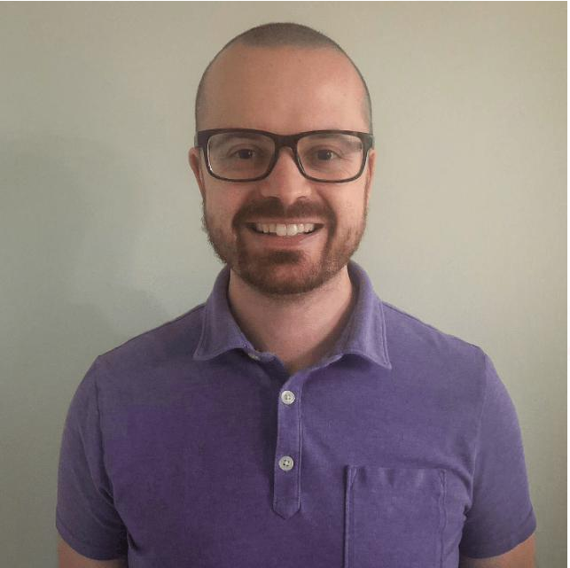
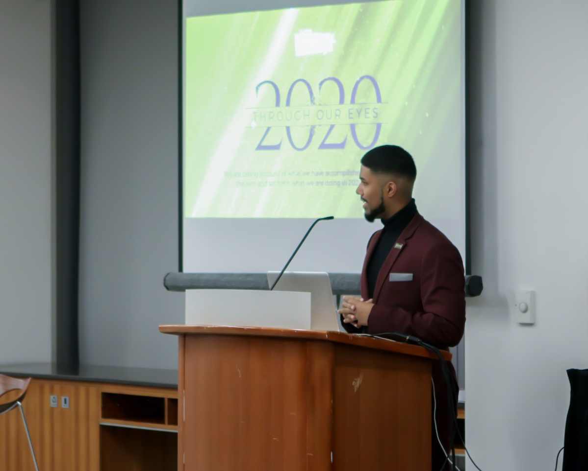

Meet the Researchers
=====================

Greydon Gilmore 
----------------

   
   Ph.D. - Biomedical Engineering Western University |
   Neurophysiologist 

Greydon Gilmore is a current Ph.D. Candidate in Biomedical Engineering in the lab of Dr. Mandar Jog and Dr. Rajni Patel. His research interests include deep brain stimulation and localization techniques for electrodes post-operation. He has several industry partnered grants focused on improving precision and outcome of deep brain stimulation surgery for movement disorders.

Contact: 
   greydongilmore@gmail.com

More on Greydon:
   - https://greydongilmore.com
   - https://linkedin.com/in/greydongilmore/
   - https://github.com/greydongilmore

Wafiq Syed
-----------

   Masters in Management of AI |
   Data Scientist |
   Digital Marketer

Wafiq Syed completed his undergraduate degree at Western University (2019) in Medical Science and Computer Science. Currently he is pursuing his Masters in Management of Artificial Intelligence at Smith School of Business. Wafiq has a keen interest on discovering innovative ways to automate existing processes to improve quality of life. Currently, Wafiq is a big data engineer in Missisauga, Canada.

Contact:
   wafiqsyedr@gmail.com

More on Wafiq:
   - https://linkedin.com/in/wafiqsyed/
   - https://github.com/wafiqsyed
