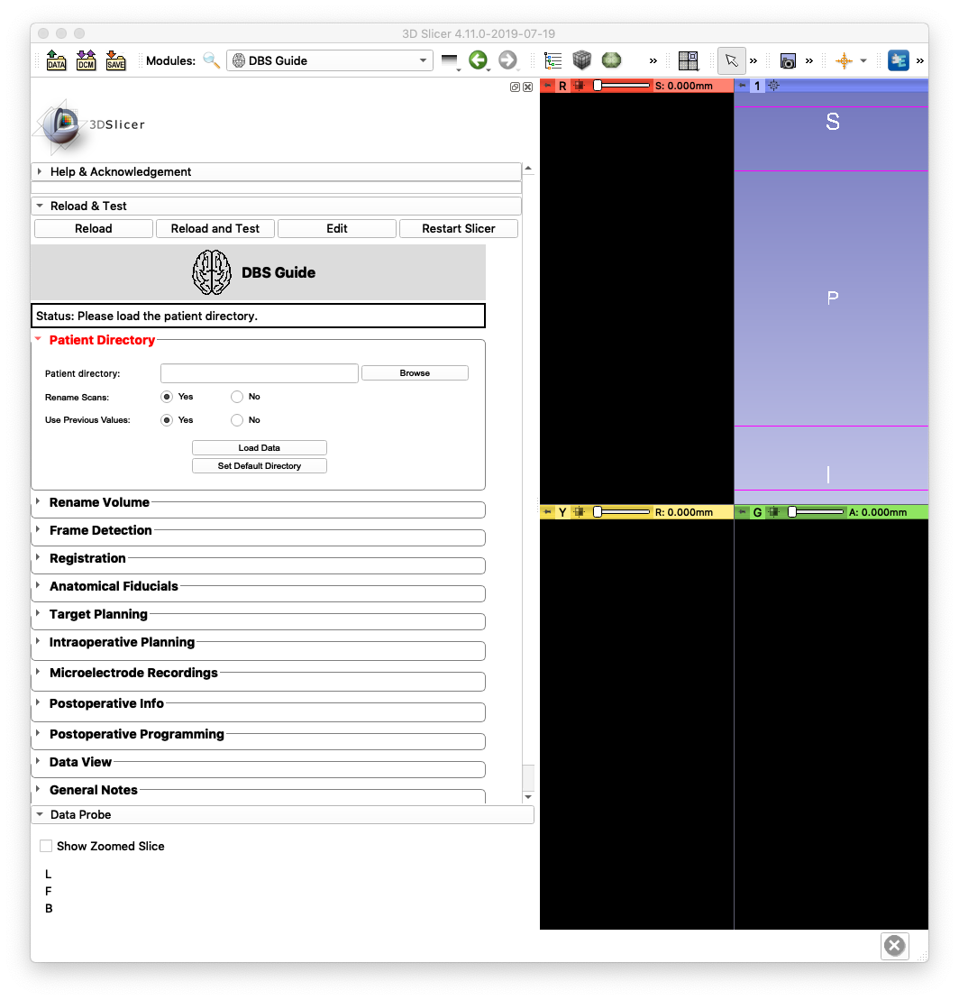

.. sample project documentation master file, created by
   sphinx-quickstart on Sun Jul  7 01:30:14 2019.
   You can adapt this file completely to your liking, but it should at least
   contain the root `toctree` directive.

**DBS Guide** 
==========================================
Neurosurgical Visualization Software for Deep Brain Stimulation
----------------------------------------------------------------

**Greydon Gilmore** *(Ph.D - Biomedical Engineering at Western University)*

**Wafiq Syed** *(Masters in Management of Artificial Intelligence at Smith School of Business)*

What is DBS Guide?
^^^^^^^^^^^^^^^^^^
**DBS Guide** is a surgical planning, visuazliation, and postoperative assessment tool used for deep brain stimulation. It provides capabilities across the entire surgical spectrum:

- Pre-operative
   - Co-registration of MRI scans with 3D volumetric stealth MRI
   - Planning DBS lead trajectory 
- Intra-operative
   - Co-restration of frame CT with MRI 
   - Confirmation of frame fiducials using automated frame detection (DBS Guide identifies the frame fiducials using image recognition)
   - Determining accuracy of (x,y,z) coordinates, arc and ring angles
   - Mapping of microelectrode (MER) recordings and plotting them in patient brain anatomy
   - Saving information regarding the trajectory used (medial, lateral, etc.) and other lead implant specs (e.g. depth)
- Post-operative
   - Co-registration of post-op CT with pre-op MRI 
   - Visualization of implanted electrodes with high accuracy
   - Manipulation of stimulation settings 
   - Volume tissue activation model based on stimulation settings

DBS Guide can be incorporated into 3D Slicer as an extension module. 
To get a walk-through of DBS Guide and its capabilities in each phase of surgery (pre/intra/post-op), visit :ref:`How to Use DBS Guide <usage>`.
To get started, visit :ref:`Installation Tutorial <Installation>`.

.. toctree::
   :maxdepth: 2
   :caption: User Guide

   Home <self>
   about
   install
   usage
   contact
   
.. toctree::
   :maxdepth: 2
   :caption: Developer Documentation

   mainScript
   widgetsAPI

