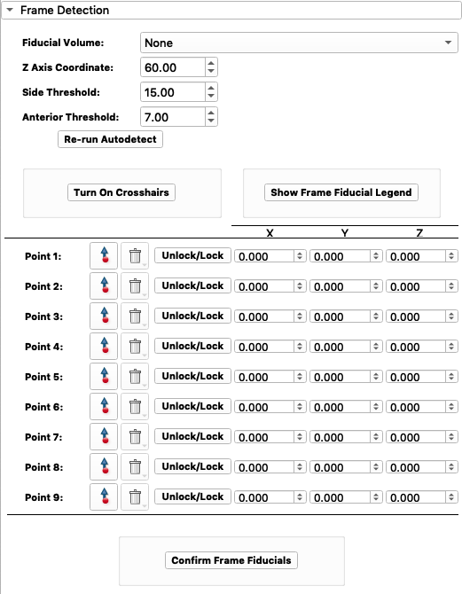

User Interface Widgets
=======================
This section provides the documentation on the code behind DBS Guide. 

Contents
----------

1. :class:`Update Widget <dbsGuideWidgets.wig_13_updateWidget>`
2. :class:`Patient Directory Widget <dbsGuideWidgets.wig_01_patientDirectoryWidget>` 
3. :class:`Patient Info Widget <dbsGuideWidgets.wig_02_patientInfoWidget>` 
4. :class:`Frame Detection Widget <dbsGuideWidgets.wig_03_frameDetectionWidget>`
5. :class:`Registration Widget <dbsGuideWidgets.wig_04_registrationWidget>`
6. :class:`Anatomical Fiducials Widget <dbsGuideWidgets.wig_05_anatomicalFiducialsWidget>`
7. :class:`Target Planning Widget <dbsGuideWidgets.wig_06_targetPlanningWidget>`
8. :class:`Intraoperative Planning Widget <dbsGuideWidgets.wig_07_intraopPlanningWidget>`
9. :class:`Microelectrode Recordings Widget <dbsGuideWidgets.wig_08_intraopMicroelectrodeWidget>`
10. :class:`Postoperative Info Widget <dbsGuideWidgets.wig_09_postopElectrodeWidget>` 
11. :class:`Postoperative Programming Widget <dbsGuideWidgets.wig_11_postopProgrammingWidget>` 
12. :class:`Data View Widget <dbsGuideWidgets.wig_10_dataVisualizationWidget>` 
13. :class:`Notes Widget <dbsGuideWidgets.wig_12_notesWidget>`  

1. Update Widget (Status Bar)
-------------------------------

.. automodule:: dbsGuideWidgets.wig_13_updateWidget
	:members:

2. Patient Directory Widget 
-----------------------------

.. automodule:: dbsGuideWidgets.wig_01_patientDirectoryWidget
	:members:

3. Patient Info Widget 
------------------------

.. automodule:: dbsGuideWidgets.wig_02_patientInfoWidget
	:members:

4. Frame Detection Widget
---------------------------

.. automodule:: dbsGuideWidgets.wig_03_frameDetectionWidget
	:members:

5. Registration Widget
---------------------------

.. image:: Images/widget04.png

.. automodule:: dbsGuideWidgets.wig_04_registrationWidget
	:members:

6. Anatomical Fiducials Widget
-------------------------------

.. automodule:: dbsGuideWidgets.wig_05_anatomicalFiducialsWidget
	:members:

7. Target Planning Widget
-------------------------------

.. automodule:: dbsGuideWidgets.wig_06_targetPlanningWidget
	:members:

8. Intraoperative Planning Widget
----------------------------------

.. automodule:: dbsGuideWidgets.wig_07_intraopPlanningWidget
	:members:

9. Microelectrode Recordings Widget
------------------------------------

.. automodule:: dbsGuideWidgets.wig_08_intraopMicroelectrodeWidget
	:members:

10. Postoperative Info Widget
-------------------------------

.. automodule:: dbsGuideWidgets.wig_09_postopElectrodeWidget
	:members:

11. Postoperative Programming Widget
------------------------------------

.. automodule:: dbsGuideWidgets.wig_11_postopProgrammingWidget
	:members:

12. Data View Widget
-------------------------------

.. automodule:: dbsGuideWidgets.wig_10_dataVisualizationWidget
	:members:

13. Notes Widget
-----------------

.. automodule:: dbsGuideWidgets.wig_12_notesWidget
	:members:

